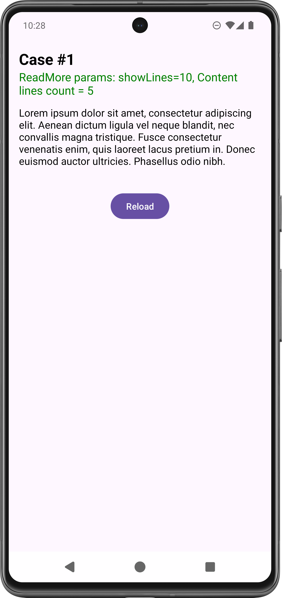
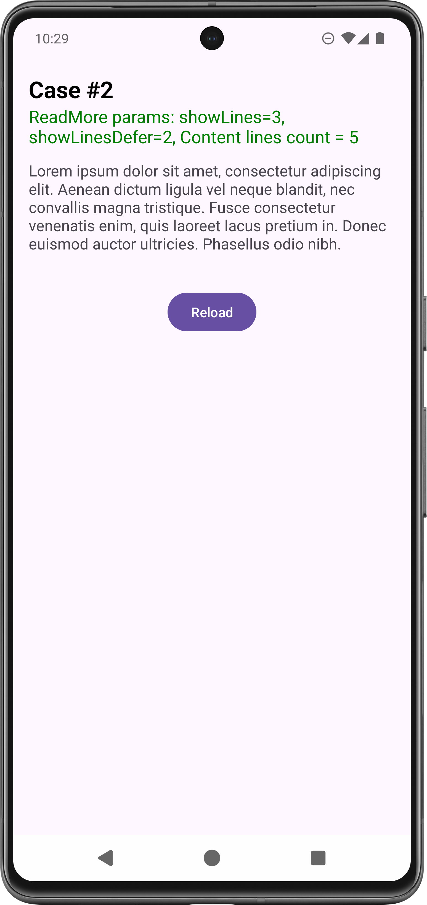
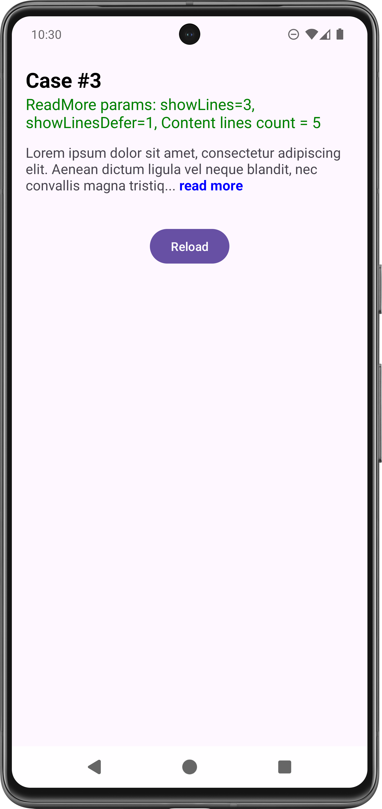
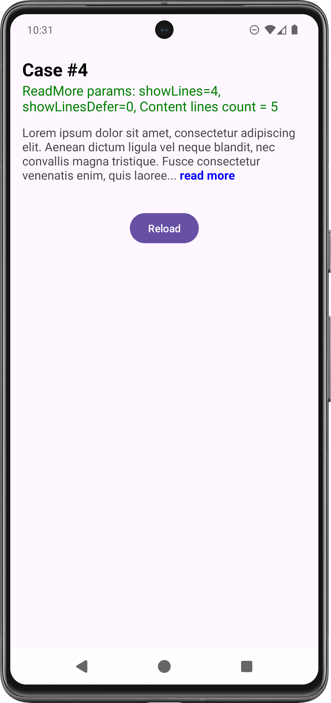

# TextView ReadMore Extension

The `setReadMoreText` extension customizes a `TextView` to display a limited number of lines (`showLines`) 
and appends a "Read More" button if the content exceeds this limit. It first checks whether the conditions 
for truncating the text are met. If so, it truncates the text and appends a "Read More" span that users can 
click to expand the content. The function ensures proper formatting by maintaining words on a single 
line and styling the "Read More" text according to the specified parameters.

**Usage:**

    textView.setReadMoreText(
	    text = getString(R.string.content_long_text),  
	    showLines = 5 // Show only 5 lines and read more button  
	)

# Screenshots
|  |  |  |  |  
|----------------------------------------------|----------------------------------------------|----------------------------------------------|----------------------------------------------|   
> The screenshots and content line count calculation taken on device `Pixel 7 Pro` with screen params `6.71 - 1440x3120 - 560 dpi`. On different device content line counts can be different.

# Supported customizations

    textView.setReadMoreText(  
	    text = getString(R.string.content_long_text), // Content
	    showLines = 5, // Define how many lines are visible before show read more button  
	    showLinesDefer = 2, // Acts as a buffer for showLines count for more smooth work  
	    readMoreText = "Read more button", // Read more button text  
	    readMoreStyleParam = ReadMoreSpan.StyleParam(  
		    textColor = Color.BLUE, // Read more button text color  
		    textStyle = Typeface.BOLD // Read more button text style  
	     ),  
	     readMoreClickListener = {} // Read more button custom click listener  
     )

# Setup for personal use

To build the project, follow these steps:

1. **Open the Project in Android Studio:**
- Launch Android Studio.
   - Click on `File > Open...` and select the root directory of your project.

2. **Sync Gradle:**
- Android Studio will automatically detect the Gradle files and sync the project. If not, you  
  can manually sync by clicking on `Sync Project with Gradle Files` in the toolbar.

3. **Build the Project:**
- You can build the project by selecting `Build > Make Project` or by clicking the `Build` icon  
  in the toolbar.